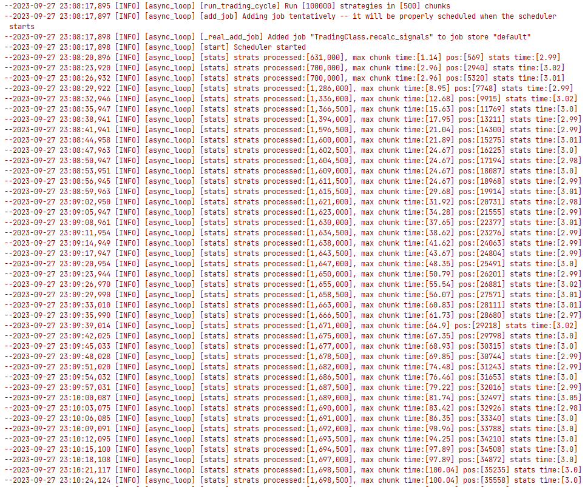
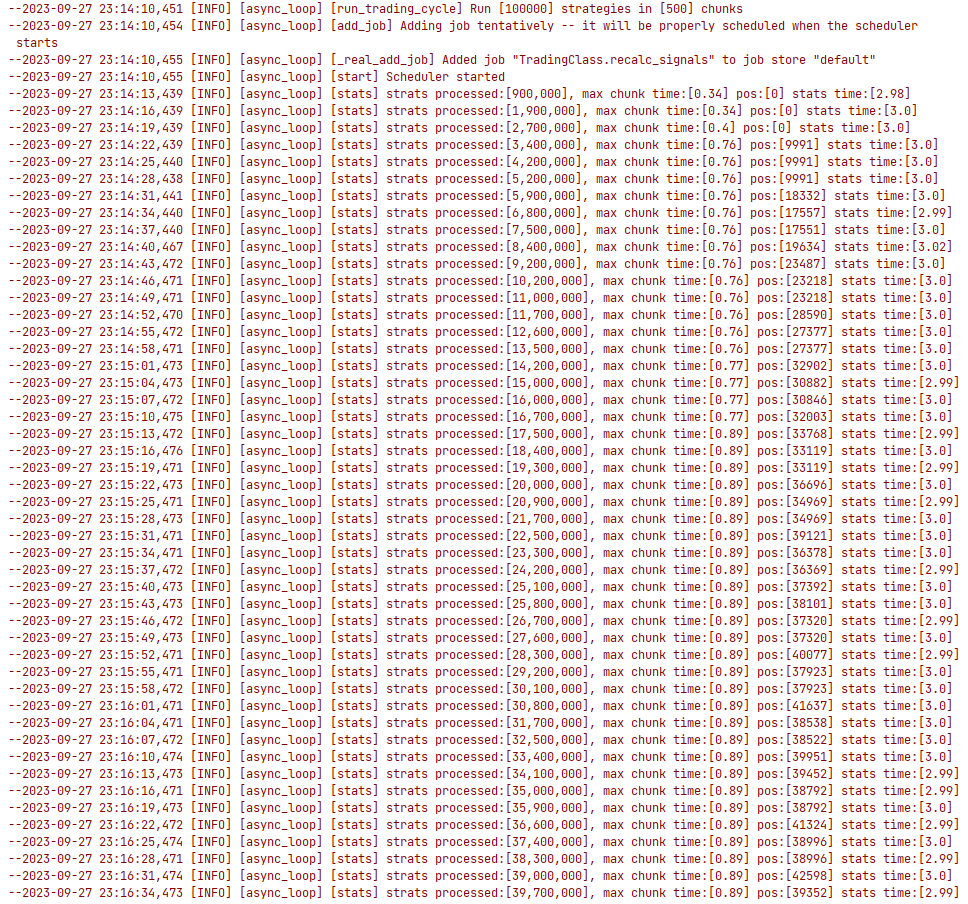

# Async Order Flow in Python for HFT/MFT Strategies

## Problem Statement

The task at hand is to accelerate the processing of a large number of multi-parameter trading strategies on timeframes from 1 minute and above. There can be as many as 10,000, 50,000, or more trading strategies. If each strategy is wrapped in an `asyncio.create_task()`, we would incur overhead in creating a corresponding number of separate asynchronous tasks, making it harder to manage. In this case, strategies are divided into chunks of `strat_chunk_size`. Processing each chunk occurs in a `while True` loop, with control handed back to the main asynchronous loop using `await asyncio.sleep(0)`.

Trading strategies receive signals at scheduled intervals, such as every 5 minutes (10 seconds in our test example). Afterward, it's necessary to check the status of each strategy and react at least once every few seconds to send and receive information to and from the exchange.

In the current implementation, order execution on the exchange is done using the await mechanism in `MODE_AWAIT`. In this case, when one of the strategies begins interacting with the exchange, all other strategies from the same chunk await until this particular strategy completes all the necessary functions. This works well when the number of strategies is small and response time is not critical.

As the number of strategies increases, it's essential to at least maintain the processing time of one strategy, if not reduce it.

## Hypothesis

A hypothesis has emerged that functions related to interacting with the exchange, associated with specific tasks (entering a trade, exiting a trade), can be wrapped in separate asynchronous tasks that will run in a separate loop using `asyncio.create_task()`. Therefore, if one strategy starts interacting with the exchange, other strategies from the same chunk can continue working without waiting for it. This way, the response time of strategies to signals will be reduced.

## Testing

Along with the acceleration of the loop's work, a problem has arisen where the same strategy can be checked for conditions several times and launch multiple asynchronous tasks for entering or exiting a trade. To solve this problem, a locking mechanism needs to be introduced, which will prevent the launch of new asynchronous tasks for a strategy until the previous one is completed. For this purpose, the `@locking_strat` decorator has been created, which prevents the launch of new asynchronous tasks for a strategy until the previous one is completed.

To run the example as if it worked without these innovations, initialize the `TradingClass` class with the `mode=MODE_AWAIT` attribute.

Each line of the stats function represents a record for 3 seconds  of the test bench's operation. We start with an empty portfolio and gradually begin to accumulate and liquidate positions for each strategy. For each strategy, we can either be in a position (1) or out of a position (0). Signals arrive on schedule every 10 seconds: for entering a position, exiting a position, or an empty signal. The number of positions is indicated in the "Pos" section.

As can be seen from the screenshot above, we start with a relatively fast chunk processing time of roughly 1 second. The number of processed strategies is measured in hundreds of thousands for a single record. However, as soon as we begin interacting with the exchange, the processing time for one chunk starts to increase significantly, and the number of processed strategies almost reaches an asymptote. 

To run the example with the new approach, initialize the `TradingClass` class in main.py with the `mode=MODE_FUTURE` attribute. 

If you look at the results of the program's operation in `MODE_FUTURE`, you can see that the number of processed strategies consistently increases by several thousand per iteration. The maximum processing time for one chunk during the program's operation does not exceed 1 second, and the number of positions is proportional to the previous mode.

You can also experiment with the `num_strategies`, `strat_chunk_size` and different `asyncio.sleep()`parameters.

## Conclusion

Therefore, splitting strategies into chunks, grouping exchange interaction functions into separate asynchronous tasks, and locking the launch of new asynchronous tasks for a strategy allows us to speed up the processing of a large number of strategies.

